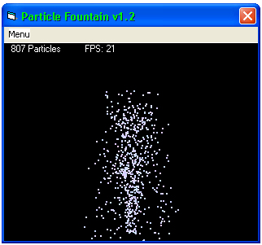



## Particle Fountain v1\.2 \*\*\*UPDATED\*\*\*

### Description

This program demonstrates the use of an array of particles with a very basic physics engine to make a nice looking fountain effect.

It uses very simple graphics (PSet), no fancy DirectX or even any BitBlt. Great for beginners.

Features:

* Smooth, efficient running

* Change particle spawning at runtime

* Instant Particle Respawning (IPR)

Changes from v1.1 to v1.2:

* Fixed Exit button (forgot to code it last time, doh!)

* Added draw width controls (How large each pixel is)

* Added Auto Redraw option (Decreases flicker, but decreases performance)
 
### More Info
 
On very low spec systems, the OS might lag a bit whilst the program is running. To fix this, set LowSpecs to true in the modFountain module.

             |
---                |---
**Submitted On**   |2005-05-16 20:34:04
**By**             |[Burningmace](https://github.com/Planet-Source-Code/PSCIndex/blob/master/ByAuthor/burningmace.md)
**Level**          |Beginner
**User Rating**    |4.8 (24 globes from 5 users)
**Compatibility**  |VB 6\.0
**Category**       |[Graphics](https://github.com/Planet-Source-Code/PSCIndex/blob/master/ByCategory/graphics__1-46.md)
**World**          |[Visual Basic](https://github.com/Planet-Source-Code/PSCIndex/blob/master/ByWorld/visual-basic.md)
**Archive File**   |[Particle\_F1890085202005\.zip](https://github.com/Planet-Source-Code/burningmace-particle-fountain-v1-2-updated__1-60554/archive/master.zip)

